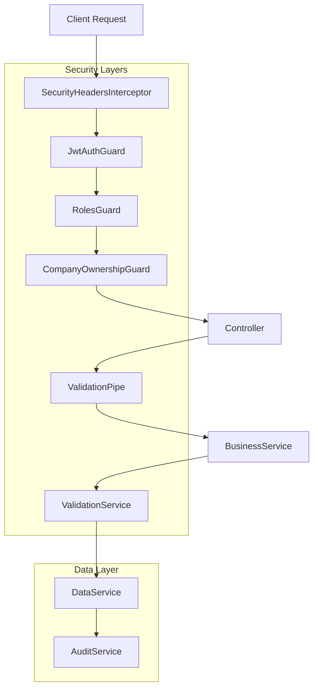
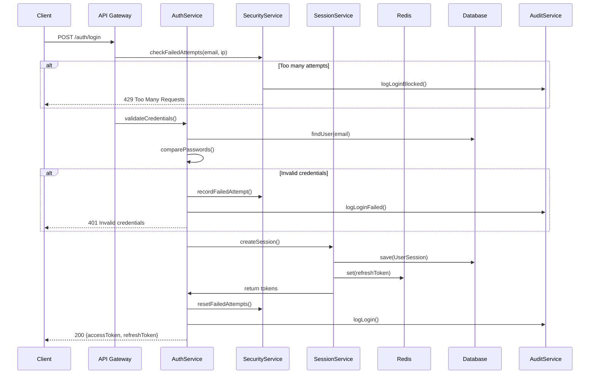
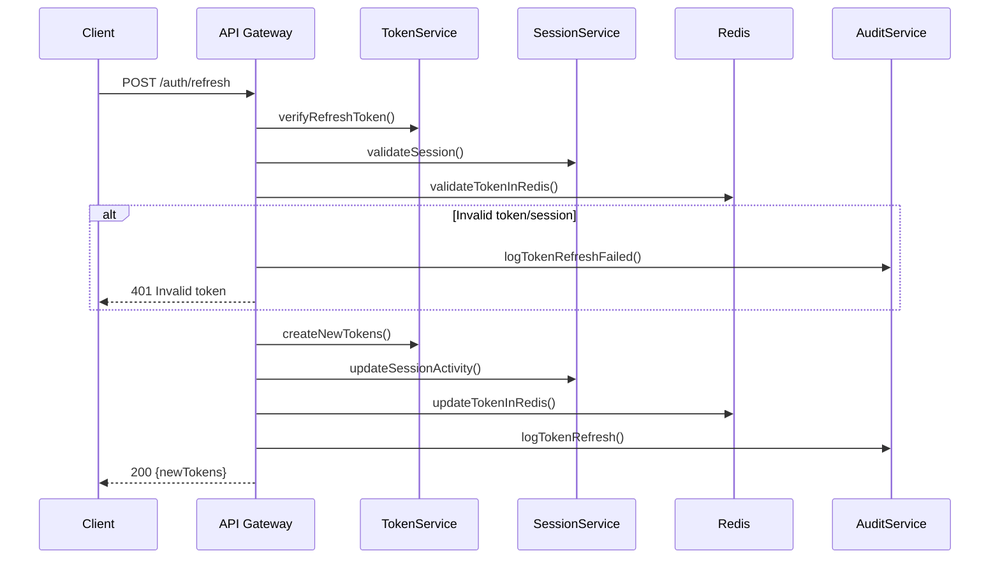

# 🛡️ DriveCare V2: Enterprise Security Architecture Documentation

## 📋 Table of Contents

1. [Executive Summary](#executive-summary)
2. [Security Architecture Overview](#security-architecture-overview)
3. [Authentication & Authorization Flow](#authentication--authorization-flow)
4. [Multi-Tenant Security Model](#multi-tenant-security-model)
5. [Role-Based Access Control (RBAC)](#role-based-access-control-rbac)
6. [Security Patterns & Code Standards](#security-patterns--code-standards)
7. [Migration Guide for Other Modules](#migration-guide-for-other-modules)
8. [AI Assistant Guidelines](#ai-assistant-guidelines)
9. [Security Checklist](#security-checklist)
10. [Performance & Scalability](#performance--scalability)

---

## 🎯 Executive Summary

**DriveCare V2** implements enterprise-grade security architecture following **OWASP Top 10**, **Zero-Trust principles**, and **Multi-Tenant isolation**. The system provides comprehensive protection against common vulnerabilities while maintaining high performance and scalability.

### 🏆 Key Security Features
- ✅ **Multi-Tenant Data Isolation** - Complete company data segregation
- ✅ **Role-Based Access Control** - 13 hierarchical roles across platform and company levels
- ✅ **Session Management** - JWT + Redis with device tracking
- ✅ **Audit Trail** - Complete logging of all security events
- ✅ **XSS Protection** - Input sanitization and validation
- ✅ **Rate Limiting** - Brute force and DDoS protection
- ✅ **Zero-Trust Architecture** - Verify everything, trust nothing

### 📊 Security Metrics
- **Authentication**: JWT with 15min access / 7d refresh tokens
- **Session Limits**: 5 concurrent sessions per user
- **Rate Limiting**: 5-50 requests/minute (endpoint-specific)
- **Password Policy**: 8+ chars, mixed case, numbers, symbols
- **Multi-Tenant**: 100% data isolation between companies

---

## 🏗️ Security Architecture Overview

### 🌐 High-Level Architecture



### 🔐 Security Layers

#### 1. **Transport Security**
```typescript
// SecurityHeadersInterceptor
{
  'X-Content-Type-Options': 'nosniff',
  'X-Frame-Options': 'DENY',
  'X-XSS-Protection': '1; mode=block',
  'Strict-Transport-Security': 'max-age=31536000; includeSubDomains',
  'Content-Security-Policy': "default-src 'self'"
}
```

#### 2. **Authentication Layer**
```typescript
// JWT Strategy with device tracking
@Injectable()
export class JwtStrategy extends PassportStrategy(Strategy) {
  async validate(payload: TokenPayload) {
    // Validate session exists and is active
    // Check device fingerprint
    // Verify company membership
    return userPayload;
  }
}
```

#### 3. **Authorization Layer**
```typescript
// Role-based access control
@Roles('company_admin', 'company_owner', 'superadmin')
@UseGuards(JwtAuthGuard, RolesGuard, CompanyOwnershipGuard)
```

#### 4. **Data Validation Layer**
```typescript
// Enterprise validation with XSS protection
@UsePipes(EnhancedValidationPipe)
```

---

## 🔐 Authentication & Authorization Flow

### 🚀 Login Flow



### 🔄 Token Refresh Flow



---

## 🏢 Multi-Tenant Security Model

### 🔒 Core Principles

1. **Complete Data Isolation**: Each company's data is completely isolated
2. **Zero Cross-Tenant Access**: Impossible to access other company's data
3. **Superadmin Override**: Only superadmin can access cross-tenant data
4. **Audit Everything**: All cross-tenant operations are logged

### 🛡️ Implementation

#### Database Level Isolation
```typescript
// Every query includes company isolation
async getUsers(filter: UserFilter, currentUser: any): Promise<PaginatedUsersResponseDto> {
  const queryBuilder = this.usersRepository.createQueryBuilder('user');
  
  // 🔐 CRITICAL: Multi-tenant isolation
  if (currentUser.role !== 'superadmin') {
    queryBuilder.andWhere('user.company_id = :companyId', { 
      companyId: currentUser.companyId 
    });
  }
  
  return queryBuilder.getMany();
}
```

#### Guard Level Protection
```typescript
// CompanyOwnershipGuard validates resource ownership
private async checkCompanyOwnership(
  user: RequestWithUser['user'], 
  companyId: string, 
  request: any
): Promise<boolean> {
  if (user.companyId !== companyId) {
    await this.auditService.log(AuditAction.ACCESS_DENIED, {
      userId: user.id,
      details: { 
        reason: 'Company ownership mismatch',
        requestedCompanyId: companyId,
        userCompanyId: user.companyId,
      },
    });
    
    throw new ForbiddenException('Multi-tenant violation blocked');
  }
  return true;
}
```

#### Service Level Validation
```typescript
// Every business operation validates ownership
async updateUserProfile(userId: string, updateData: UpdateUserProfileDto, updatedBy: string) {
  // 1. Validate user belongs to correct company
  await this.usersValidationService.validateUserOwnership(userId, updatedBy.companyId);
  
  // 2. Proceed with update
  const updatedUser = await this.usersDataService.updateUser(userId, updateData);
  
  // 3. Audit the operation
  await this.auditService.log('USER_PROFILE_UPDATED', { /* ... */ });
}
```

---

## 📋 Role-Based Access Control (RBAC)

### 👑 Role Hierarchy

```typescript
export const ROLES_HIERARCHY = {
  // 🌐 Platform Level (Global)
  'superadmin': 100,        // Full system access
  'platform_admin': 90,    // Platform administration
  'auditor': 85,           // Read-only access for auditing
  'support_engineer': 80,  // Technical support access
  'system_operator': 75,   // System operations
  
  // 🏢 Company Level (Multi-tenant)
  'company_owner': 70,     // Company ownership
  'company_admin': 60,     // Company administration
  'manager': 50,           // Operations management
  'lead_mechanic': 40,     // Technical leadership
  'service_advisor': 35,   // Customer interface
  'cashier': 30,           // Financial operations
  'inventory_manager': 30, // Inventory management
  'mechanic': 20,          // Technical work
  'diagnostic': 20,        // Diagnostic work
} as const;
```

### 🛡️ Permission Matrix

| Operation | superadmin | platform_admin | company_owner | company_admin | manager | mechanic |
|-----------|------------|----------------|---------------|---------------|---------|----------|
| Create User | ✅ | ❌ | ✅ | ✅ | ❌ | ❌ |
| Delete User | ✅ | ❌ | ✅ | ❌ | ❌ | ❌ |
| Change Role | ✅ | ❌ | ✅ | ❌ | ❌ | ❌ |
| View Orders | ✅ | 👁️ | ✅ | ✅ | ✅ | Own Only |
| Manage Inventory | ✅ | ❌ | ✅ | ✅ | ✅ | ❌ |

**Legend**: ✅ Full Access, 👁️ Read Only, ❌ No Access

### 🔧 Implementation

#### Role Decorator
```typescript
// Type-safe role assignment
export const Roles = (...roles: AuthRole[]) => SetMetadata(ROLES_KEY, roles);

// Usage in controllers
@Roles('company_admin', 'company_owner', 'superadmin')
@Patch(':id/profile')
async updateUserProfile() { /* ... */ }
```

#### Role Guard
```typescript
@Injectable()
export class RolesGuard implements CanActivate {
  canActivate(context: ExecutionContext): boolean {
    const requiredRoles = this.reflector.getAllAndOverride<AuthRole[]>(ROLES_KEY, [
      context.getHandler(),
      context.getClass(),
    ]);
    
    const { user } = context.switchToHttp().getRequest();
    
    // Superadmin bypasses all checks
    if (user.role === 'superadmin') return true;
    
    return requiredRoles.some(role => user.role === role);
  }
}
```

#### Hierarchical Validation
```typescript
// Prevent privilege escalation
private canAssignRole(assignerRole: AuthRole, targetRole: AuthRole): boolean {
  const assignerLevel = ROLES_HIERARCHY[assignerRole] || 0;
  const targetLevel = ROLES_HIERARCHY[targetRole] || 0;
  
  return assignerLevel > targetLevel; // Can only assign lower roles
}
```

---

## 🔧 Security Patterns & Code Standards

### 🏗️ 4-Layer Enterprise Architecture

#### 1. **Controller Layer** (API Gateway)
```typescript
@ApiTags('👥 Управление пользователями')
@Controller('users')
@UseGuards(JwtAuthGuard, RolesGuard) // 🔐 Authentication + Authorization
@UseInterceptors(AuditLoggingInterceptor) // 📝 Audit trail
@UsePipes(EnhancedValidationPipe) // ✅ Input validation
@ApiBearerAuth('JWT-auth')
export class UsersController {
  constructor(
    private readonly usersBusinessService: UsersBusinessService
  ) {}

  @Patch(':id/profile')
  @Roles('company_admin', 'company_owner', 'superadmin')
  @Throttle({ default: { limit: 20, ttl: 60000 } }) // 🚫 Rate limiting
  async updateUserProfile(
    @Param('id') userId: string,
    @Body() updateDto: UpdateUserProfileDto, // 🛡️ DTO validation
    @Req() req: RequestWithUser, // 🔐 Authenticated request
  ): Promise<UserResponseDto> {
    return this.usersBusinessService.updateUserProfile(
      userId, 
      updateDto, 
      req.user.id
    );
  }
}
```

#### 2. **Business Layer** (Orchestration)
```typescript
@Injectable()
export class UsersBusinessService {
  async updateUserProfile(
    userId: string, 
    updateData: UpdateUserProfileDto, 
    updatedBy: string
  ): Promise<UserResponseDto> {
    const startTime = Date.now();
    
    try {
      // 1. 🔐 Security validation
      await this.usersValidationService.validateUpdateProfileData(userId, updateData);
      
      // 2. 📊 Get before state for audit
      const beforeUser = await this.usersDataService.findByIdWithRole(userId);
      
      // 3. 💾 Execute update in transaction
      const updatedUser = await this.usersDataService.updateUserWithTransaction(
        userId, 
        updateData
      );
      
      // 4. 📝 Audit logging
      await this.auditService.log('USER_PROFILE_UPDATED', {
        userId: updatedBy,
        entityId: userId,
        changes: this.usersMapperService.mapChangesForAudit(beforeUser, updatedUser),
        metadata: { executionTime: Date.now() - startTime }
      });
      
      return this.usersMapperService.mapToResponseDto(updatedUser);
      
    } catch (error) {
      // 🚨 Error audit logging
      await this.auditService.log('USER_PROFILE_UPDATE_FAILED', {
        userId: updatedBy,
        entityId: userId,
        details: { error: error.message }
      });
      throw error;
    }
  }
}
```

#### 3. **Validation Layer** (Security Enforcement)
```typescript
@Injectable()
export class UsersValidationService {
  async validateUpdateProfileData(
    userId: string, 
    updateData: UpdateUserProfileDto
  ): Promise<void> {
    // 1. 🔍 Check user exists
    await this.validateUserExists(userId);
    
    // 2. 📧 Validate email uniqueness
    if (updateData.email) {
      await this.validateEmailUniqueness(updateData.email, userId);
    }
    
    // 3. 🛡️ XSS protection
    this.validateContactInfo(updateData);
  }

  private validateTextFieldForXSS(value: string, fieldName: string): void {
    const xssPatterns = [
      /<script\b[^<]*(?:(?!<\/script>)<[^<]*)*<\/script>/gi,
      /javascript:/i,
      /on\w+\s*=/i,
      // ... more patterns
    ];
    
    for (const pattern of xssPatterns) {
      if (pattern.test(value)) {
        throw new BadRequestException(
          `Field "${fieldName}" contains potential XSS attack. Blocked.`
        );
      }
    }
  }
}
```

#### 4. **Data Layer** (Database Operations)
```typescript
@Injectable()
export class UsersDataService {
  async updateUserWithTransaction(
    userId: string, 
    updateData: UpdateUserProfileDto
  ): Promise<User> {
    return this.dataSource.transaction(async manager => {
      // 🔒 Atomic operation
      const updateResult = await manager.update(User, userId, updateData);
      
      if (updateResult.affected === 0) {
        throw new NotFoundException(`User with ID ${userId} not found`);
      }
      
      // 📊 Return updated user with relations
      return manager.findOne(User, {
        where: { id: userId },
        relations: ['role']
      });
    });
  }
}
```

### 🔐 Security Code Patterns

#### Input Sanitization Pattern
```typescript
// ✅ DO: Always sanitize and validate input
@IsOptional()
@IsEmail({}, { message: 'Invalid email format' })
@Length(1, 255, { message: 'Email cannot exceed 255 characters' })
@Transform(({ value }) => value?.trim().toLowerCase()) // Normalize
email?: string;

// ❌ DON'T: Trust user input
@Column() 
email: string; // No validation
```

#### Multi-Tenant Query Pattern
```typescript
// ✅ DO: Always include company isolation
async findUsersByCompany(companyId: string): Promise<User[]> {
  return this.usersRepository.find({
    where: { company_id: companyId }, // 🔐 Company isolation
    relations: ['role']
  });
}

// ❌ DON'T: Global queries without isolation
async findAllUsers(): Promise<User[]> {
  return this.usersRepository.find(); // 🚨 Security vulnerability
}
```

#### Audit Pattern
```typescript
// ✅ DO: Audit all security-sensitive operations
async deleteUser(userId: string, deletedBy: string): Promise<void> {
  const user = await this.findUserById(userId);
  
  await this.softDeleteUser(userId);
  
  // 📝 Audit critical operation
  await this.auditService.log('USER_DELETED', {
    userId: deletedBy,
    entityId: userId,
    details: {
      deletedUserEmail: user.email,
      deletionType: 'soft_delete'
    }
  });
}
```

#### Error Handling Pattern
```typescript
// ✅ DO: Security-aware error handling
try {
  await this.businessOperation();
} catch (error) {
  // 📝 Audit failed operations
  await this.auditService.log('OPERATION_FAILED', {
    userId: currentUser.id,
    details: { error: error.message },
    level: AuditLevel.ERROR
  });
  
  // 🛡️ Don't leak sensitive information
  if (error instanceof UnauthorizedException) {
    throw new ForbiddenException('Access denied');
  }
  
  throw error;
}
```

---

## 🚀 Migration Guide for Other Modules

### 📋 Step-by-Step Migration Process

#### Phase 1: Security Baseline (Critical)
```typescript
// 1. Update role references
// ❌ OLD
@Roles('owner', 'admin', 'manager')

// ✅ NEW  
@Roles('company_owner', 'company_admin', 'manager')

// 2. Add security guards
@UseGuards(JwtAuthGuard, RolesGuard)
@UseInterceptors(AuditLoggingInterceptor)
@UsePipes(EnhancedValidationPipe)

// 3. Add throttling
@Throttle({ default: { limit: 20, ttl: 60000 } })
```

#### Phase 2: Multi-Tenant Isolation (Critical)
```typescript
// 1. Add company isolation to all queries
// ❌ OLD
async findCustomers(): Promise<Customer[]> {
  return this.customersRepository.find();
}

// ✅ NEW
async findCustomers(companyId: string): Promise<Customer[]> {
  return this.customersRepository.find({
    where: { company_id: companyId } // 🔐 Multi-tenant isolation
  });
}

// 2. Add ownership validation
@Get(':id')
@UseGuards(CompanyOwnershipGuard)
@Resource('customer') // Validates customer belongs to user's company
async getCustomer(@Param('id') customerId: string) {
  return this.customersService.findById(customerId);
}
```

#### Phase 3: Enterprise Architecture
```typescript
// 1. Implement 4-layer architecture
// Create services:
// - customers-business.service.ts    (Orchestration)
// - customers-data.service.ts        (Database operations)
// - customers-mapper.service.ts      (DTO mapping)
// - customers-validation.service.ts  (Security validation)

// 2. Add comprehensive validation
@Injectable()
export class CustomersValidationService {
  async validateCustomerOwnership(customerId: string, companyId: string): Promise<void> {
    const customer = await this.customersRepository.findOne({
      where: { id: customerId },
      select: ['id', 'company_id']
    });
    
    if (!customer) {
      throw new NotFoundException(`Customer with ID ${customerId} not found`);
    }
    
    if (customer.company_id !== companyId) {
      throw new ForbiddenException('Customer belongs to different company');
    }
  }
}
```

#### Phase 4: Audit & Compliance
```typescript
// 1. Add audit logging to all operations
async createCustomer(customerData: CreateCustomerDto, createdBy: string): Promise<Customer> {
  const startTime = Date.now();
  
  try {
    const customer = await this.dataService.createCustomer(customerData);
    
    // 📝 Audit successful operation
    await this.auditService.log('CUSTOMER_CREATED', {
      userId: createdBy,
      entityId: customer.id,
      companyId: customer.company_id,
      details: {
        customerName: `${customer.firstName} ${customer.lastName}`,
        email: customer.email
      },
      metadata: { executionTime: Date.now() - startTime }
    });
    
    return customer;
  } catch (error) {
    // 📝 Audit failed operation
    await this.auditService.log('CUSTOMER_CREATION_FAILED', {
      userId: createdBy,
      details: { error: error.message },
      level: AuditLevel.ERROR
    });
    throw error;
  }
}
```

### 🔧 Module Template

```typescript
// modern-module.template.ts
import { Module } from '@nestjs/common';
import { TypeOrmModule } from '@nestjs/typeorm';

import { ModuleController } from './module.controller';
import { ModuleService } from './module.service';

// ✅ Enterprise 4-layer services
import { ModuleBusinessService } from './services/module-business.service';
import { ModuleDataService } from './services/module-data.service';
import { ModuleMapperService } from './services/module-mapper.service';
import { ModuleValidationService } from './services/module-validation.service';

// ✅ Entities
import { ModuleEntity } from '../../database/entities/module.entity';

// ✅ Security modules
import { CommonModule } from '../../common/common.module';
import { AuthModule } from '../auth/auth.module';

@Module({
  imports: [
    TypeOrmModule.forFeature([ModuleEntity]),
    CommonModule, // 🔐 Provides AuditService, Guards, Pipes
    AuthModule,   // 🔐 Provides authentication utilities
  ],
  controllers: [ModuleController],
  providers: [
    ModuleService, // Legacy compatibility
    
    // Enterprise architecture
    ModuleBusinessService,
    ModuleDataService,
    ModuleMapperService,
    ModuleValidationService,
  ],
  exports: [
    ModuleService,
    ModuleBusinessService,
    ModuleValidationService, // For CompanyOwnershipGuard
  ],
})
export class ModuleModule {}
```

---

## 🤖 AI Assistant Guidelines

### 📝 Code Review Checklist

When reviewing or updating modules, AI assistants should verify:

#### 🔐 Security Requirements
```typescript
// ✅ Required security decorators
@UseGuards(JwtAuthGuard, RolesGuard)
@UseInterceptors(AuditLoggingInterceptor)
@UsePipes(EnhancedValidationPipe)
@ApiBearerAuth('JWT-auth')

// ✅ Correct role names
@Roles('company_owner', 'company_admin', 'manager') // Not 'owner', 'admin'

// ✅ Rate limiting
@Throttle({ default: { limit: 20, ttl: 60000 } })

// ✅ Multi-tenant isolation
if (currentUser.role !== 'superadmin') {
  queryBuilder.andWhere('entity.company_id = :companyId', { 
    companyId: currentUser.companyId 
  });
}
```

#### 📊 Validation Requirements
```typescript
// ✅ DTO validation with security
@IsEmail({}, { message: 'Invalid email format' })
@Length(1, 255, { message: 'Email cannot exceed 255 characters' })
@Transform(({ value }) => value?.trim().toLowerCase())
@Matches(/^[a-zA-Z0-9._%+-]+@[a-zA-Z0-9.-]+\.[a-zA-Z]{2,}$/, {
  message: 'Email format is invalid'
})
email: string;

// ✅ XSS protection
@Matches(/^[a-zA-Zа-яА-Я\s\-']+$/, { 
  message: 'Name can only contain letters, spaces, hyphens and apostrophes' 
})
@Transform(({ value }) => value?.trim())
firstName: string;
```

#### 🎯 Architecture Requirements
```typescript
// ✅ 4-layer architecture pattern
@Injectable()
export class BusinessService {
  constructor(
    private readonly dataService: DataService,
    private readonly mapperService: MapperService,
    private readonly validationService: ValidationService,
    private readonly auditService: AuditService,
  ) {}
  
  async businessOperation(data: DTO, userId: string): Promise<ResponseDTO> {
    // 1. Validation
    await this.validationService.validate(data);
    
    // 2. Business logic
    const result = await this.dataService.execute(data);
    
    // 3. Audit
    await this.auditService.log('OPERATION', { userId, entityId: result.id });
    
    // 4. Mapping
    return this.mapperService.mapToResponse(result);
  }
}
```

### 🚨 Common Security Anti-Patterns to Fix

#### ❌ Authentication & Authorization
```typescript
// ❌ DON'T: Missing authentication
@Get()
async getData() { } // No @UseGuards(JwtAuthGuard)

// ❌ DON'T: Old role names
@Roles('owner', 'admin') // Should be 'company_owner', 'company_admin'

// ❌ DON'T: Missing company ownership check
async getCustomer(@Param('id') id: string) {
  return this.service.findById(id); // No company validation
}
```

#### ❌ Data Access & Validation
```typescript
// ❌ DON'T: Global queries without company isolation
async findAll(): Promise<Entity[]> {
  return this.repository.find(); // Missing company_id filter
}

// ❌ DON'T: Missing input validation
@Post()
async create(@Body() data: any) { // Should use validated DTO
  return this.service.create(data);
}

// ❌ DON'T: No XSS protection
@Column()
name: string; // Should have validation and sanitization
```

#### ❌ Audit & Monitoring
```typescript
// ❌ DON'T: Missing audit logging
async deleteCustomer(id: string) {
  await this.repository.delete(id); // No audit trail
}

// ❌ DON'T: Missing error handling
async businessOperation() {
  const result = await this.repository.save(data); // No try/catch
  return result;
}
```

### 🔧 AI Automation Rules

#### 1. **Role Name Transformation**
```typescript
// Automatic replacement rules:
'owner' → 'company_owner'
'admin' → 'company_admin'
'manager' → 'manager' (unchanged)
'mechanic' → 'mechanic' (unchanged)
```

#### 2. **Security Decorator Addition**
```typescript
// Add to all controllers:
@UseGuards(JwtAuthGuard, RolesGuard)
@UseInterceptors(AuditLoggingInterceptor)
@UsePipes(EnhancedValidationPipe)
@ApiBearerAuth('JWT-auth')
```

#### 3. **Multi-Tenant Query Pattern**
```typescript
// Transform all find operations:
// FROM: repository.find()
// TO: repository.find({ where: { company_id: companyId } })
```

#### 4. **Audit Integration**
```typescript
// Add to all CUD operations:
await this.auditService.log(ACTION, {
  userId: currentUser.id,
  entityId: entity.id,
  companyId: entity.company_id,
  details: { /* relevant data */ }
});
```

---

## ✅ Security Checklist

### 🔐 Module Security Checklist

#### Authentication & Authorization
- [ ] **JwtAuthGuard** applied to all protected endpoints
- [ ] **RolesGuard** with correct role names (`company_owner`, not `owner`)
- [ ] **CompanyOwnershipGuard** for resource-specific endpoints
- [ ] **ApiBearerAuth** documentation for Swagger
- [ ] **Throttling** configured appropriately (5-50 req/min)

#### Input Validation & Sanitization
- [ ] **EnhancedValidationPipe** applied
- [ ] **DTO validation** with proper decorators
- [ ] **XSS protection** in text fields
- [ ] **Length limits** on all string inputs
- [ ] **Email format validation** with normalization
- [ ] **Phone number validation** for Russian format

#### Multi-Tenant Security
- [ ] **Company ID filtering** in all queries (except superadmin)
- [ ] **Ownership validation** in business logic
- [ ] **Cross-tenant access prevention**
- [ ] **Superadmin exception handling**

#### Audit & Monitoring
- [ ] **AuditLoggingInterceptor** applied
- [ ] **Success operations** logged
- [ ] **Failed operations** logged with error details
- [ ] **Security events** logged (access denied, etc.)
- [ ] **Performance metrics** included in audit

#### API Documentation
- [ ] **Swagger decorators** with examples
- [ ] **Error responses** documented
- [ ] **Rate limiting** documented
- [ ] **Security requirements** documented

#### Data Protection
- [ ] **Sensitive data filtering** in responses
- [ ] **Password hashing** with bcrypt (12 rounds in prod)
- [ ] **Token security** (JWT with proper expiration)
- [ ] **Session management** with device tracking

### 🏗️ Architecture Checklist

#### Service Layer Structure
- [ ] **BusinessService** (orchestration)
- [ ] **DataService** (database operations)
- [ ] **MapperService** (DTO transformations)
- [ ] **ValidationService** (security validation)

#### Module Configuration
- [ ] **TypeORM entities** properly imported
- [ ] **CommonModule** imported for security utilities
- [ ] **AuthModule** imported for guards and types
- [ ] **Services exported** for other modules

#### Error Handling
- [ ] **Try/catch blocks** around business operations
- [ ] **Audit logging** for failed operations
- [ ] **Meaningful error messages** without sensitive data leaks
- [ ] **HTTP status codes** properly used

---

## 📊 Performance & Scalability

### 🚀 Performance Optimizations

#### Database Optimizations
```typescript
// ✅ Selective field loading
async findUser(id: string): Promise<User> {
  return this.usersRepository.findOne({
    where: { id },
    select: ['id', 'email', 'firstName', 'lastName', 'isActive'],
    relations: ['role'] // Only load needed relations
  });
}

// ✅ Efficient pagination
async getUsers(filter: UserFilter): Promise<PaginatedResponse> {
  const queryBuilder = this.usersRepository
    .createQueryBuilder('user')
    .leftJoinAndSelect('user.role', 'role')
    .where('user.company_id = :companyId', { companyId: filter.companyId })
    .orderBy('user.firstName', 'ASC')
    .skip((filter.page - 1) * filter.limit)
    .take(filter.limit);
    
  const [users, total] = await queryBuilder.getManyAndCount();
  return { users, total, page: filter.page, limit: filter.limit };
}
```

#### Caching Strategy
```typescript
// Redis caching for session validation
async validateSession(sessionId: string): Promise<boolean> {
  // 1. Check Redis cache first
  const cachedSession = await this.redis.get(`session:${sessionId}`);
  if (cachedSession) {
    return JSON.parse(cachedSession).isActive;
  }
  
  // 2. Fallback to database
  const session = await this.sessionRepository.findOne({
    where: { id: sessionId, isActive: true }
  });
  
  // 3. Cache result
  if (session) {
    await this.redis.set(`session:${sessionId}`, 
      JSON.stringify({ isActive: true }), 
      'EX', 300 // 5 minutes
    );
  }
  
  return !!session;
}
```

#### Audit Performance
```typescript
// Async audit logging to avoid blocking requests
async log(action: AuditAction, data: AuditLogData): Promise<void> {
  // Non-blocking audit logging
  setImmediate(async () => {
    try {
      await this.auditRepository.save({
        action,
        ...data,
        timestamp: new Date()
      });
    } catch (error) {
      console.error('Audit logging failed:', error);
      // Don't throw - audit failures shouldn't break business logic
    }
  });
}
```

### 📈 Scalability Considerations

#### Connection Pooling
```typescript
// Database connection configuration
export const databaseConfig = {
  maxConnections: process.env.NODE_ENV === 'production' ? 25 : 10,
  minConnections: 2,
  idleTimeout: 30000,
  connectionTimeout: 2000,
};
```

#### Rate Limiting Configuration
```typescript
// Graduated rate limiting
const rateLimits = {
  read: { limit: 50, ttl: 60000 },    // 50 req/min for read operations
  write: { limit: 20, ttl: 60000 },   // 20 req/min for write operations
  critical: { limit: 5, ttl: 60000 }, // 5 req/min for critical operations
};

@Throttle(rateLimits.critical)
@Patch(':id/role')
async updateUserRole() { }
```

#### Memory Management
```typescript
// Efficient data streaming for large datasets
async exportUsers(companyId: string): Promise<Stream> {
  return this.usersRepository
    .createQueryBuilder('user')
    .where('user.company_id = :companyId', { companyId })
    .stream(); // Stream results instead of loading all into memory
}
```

---

## 📚 Additional Resources

### 🔗 Related Documentation
- [NestJS Security Best Practices](https://docs.nestjs.com/security/overview)
- [OWASP Top 10 Web Application Security Risks](https://owasp.org/www-project-top-ten/)
- [JWT Security Best Practices](https://tools.ietf.org/html/rfc8725)

### 🛠️ Development Tools
- **ESLint Security Plugin**: `eslint-plugin-security`
- **TypeScript Strict Mode**: Enhanced type safety
- **Helmet.js**: Security headers middleware
- **Class Validator**: DTO validation with decorators

### 📊 Monitoring & Alerting
- **Audit Log Analysis**: Security event monitoring
- **Rate Limit Metrics**: DDoS and abuse detection
- **Performance Monitoring**: Response time tracking
- **Error Rate Monitoring**: System health indicators

---

**📝 Document Version**: 2.0  
**🗓️ Last Updated**: 2025-01-06  
**👨‍💼 Maintained by**: DriveCare Security Team  
**🔄 Next Review**: 2025-04-06

---

*This document serves as the definitive guide for enterprise security implementation in DriveCare V2. All development should follow these patterns and standards to ensure consistent, secure, and scalable application architecture.*
